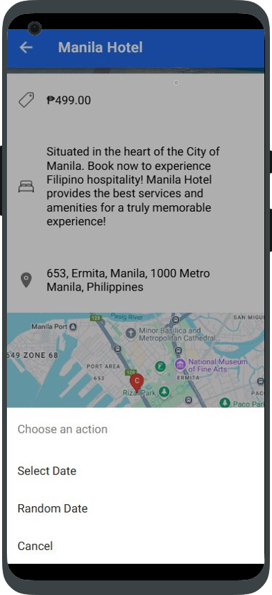
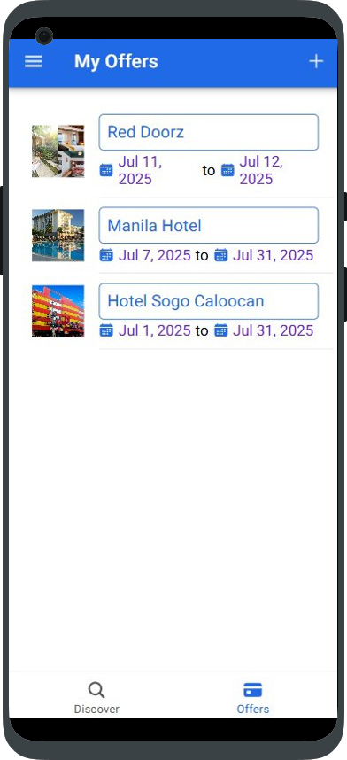
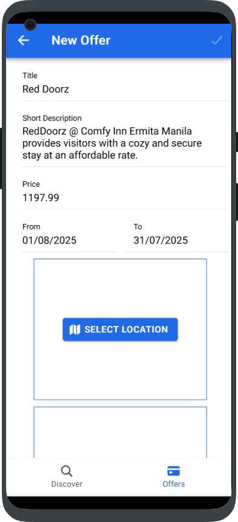
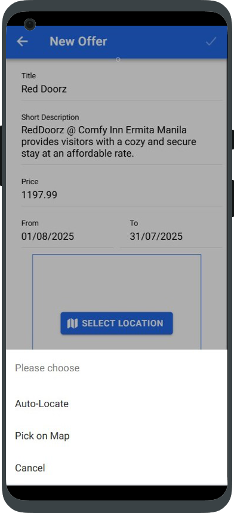
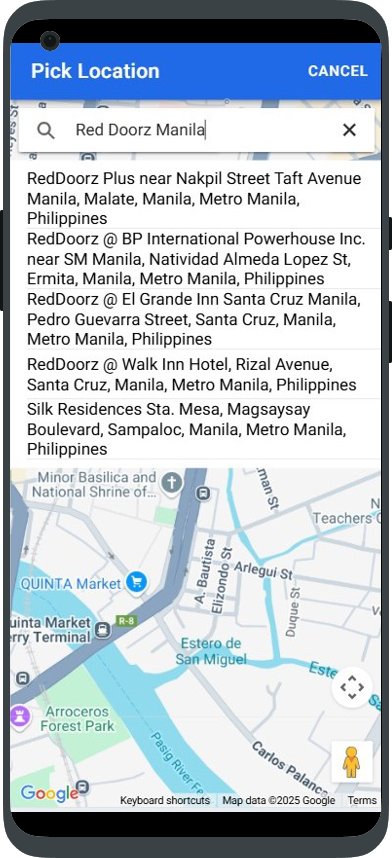
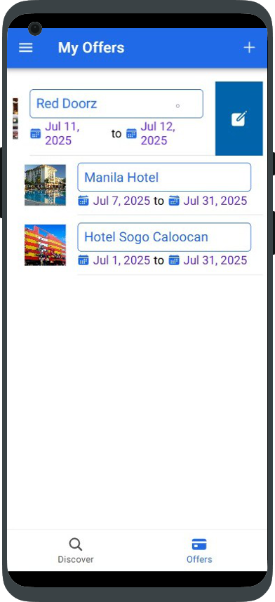

# 📚 BookiFi

**BookiFi** is a mobile MVP (Minimum Viable Product) hotel booking application built using **Ionic**, **Angular**, and **Firebase**. It allows users to sign up, log in, browse offers, and make bookings easily — all integrated with Google Maps for a seamless experience.

---

## 🔧 Tech Stack

- **Ionic Framework**
- **Angular**
- **Firebase Authentication & Firestore**
- **Google Maps API**

---

## ✨ Features

- 🔐 **Firebase Authentication**: Users can sign up and log in securely.
- 🏨 **Offer Listings**: Admins can create hotel offers; users can view and book them.
- ✏️ **Edit Bookings**: Users can modify their bookings.
- 🗺️ **Google Maps Integration**: Integrated Google Map to enhance booking location experience.
- 📋 **Bookings List Page**: Users can view all their bookings in one place.

---

## 📲 Installation

To run this project locally:

1. **Clone the repo:**

```bash
git clone https://github.com/leipriets/booki-fi.git
cd booki-fi

npm install

ionic serve
```
---

## 🚀 Usage
Create an account or sign in using Firebase Auth.

Browse the available hotel offers.

Tap on a listing to view details and book.

View your active bookings in the Bookings section.

Edit or cancel bookings as needed.

## 📸 Screenshots

### Sign In


### Sign Up


### Discover Page


### Create Bookings



### Your Bookings


### Offers Page (Admin)








---


👤 Author
Leonardo Prieto